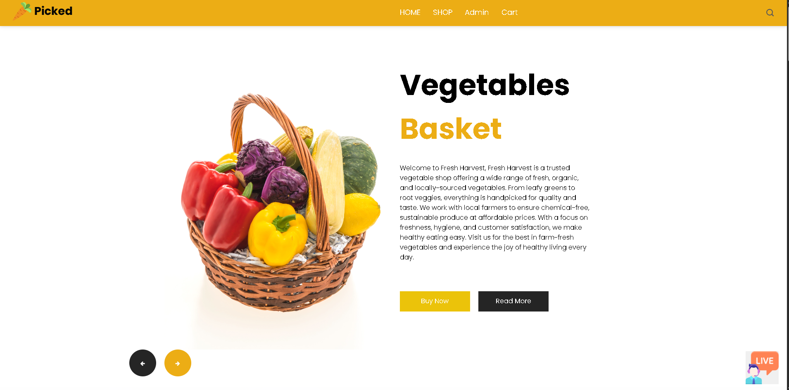
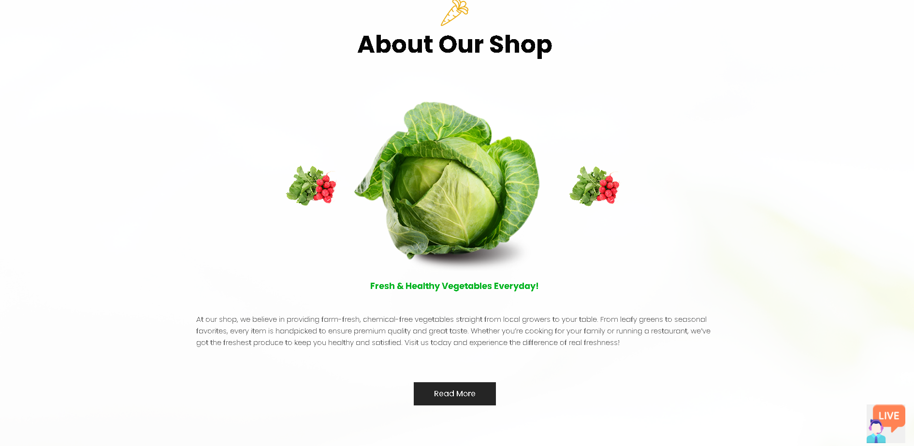
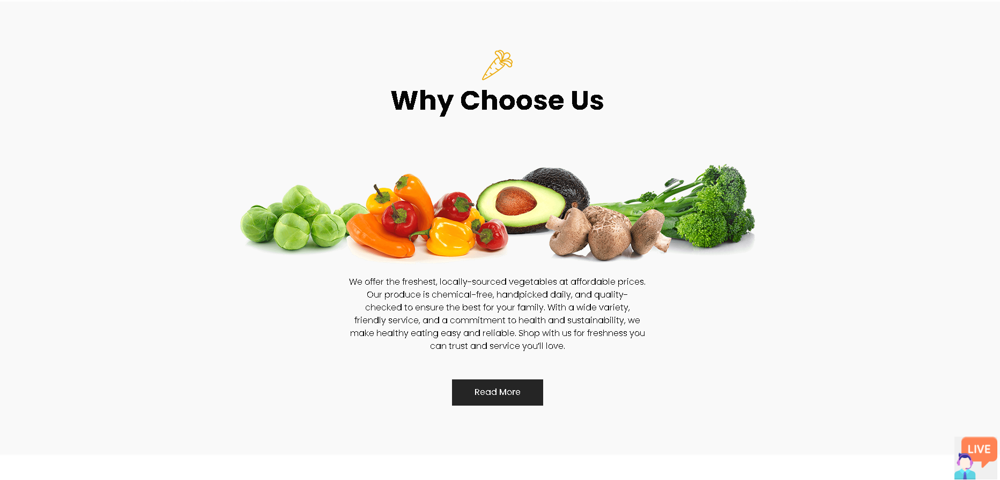
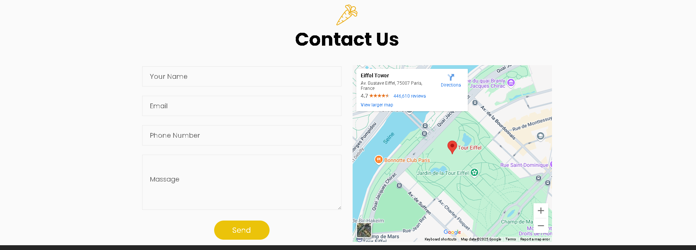
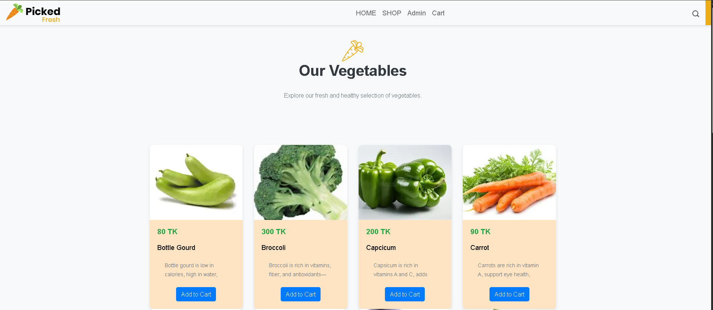
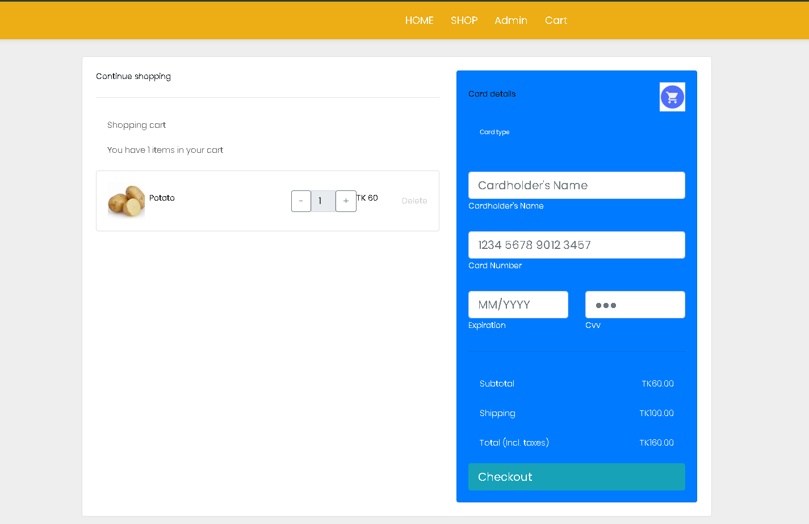
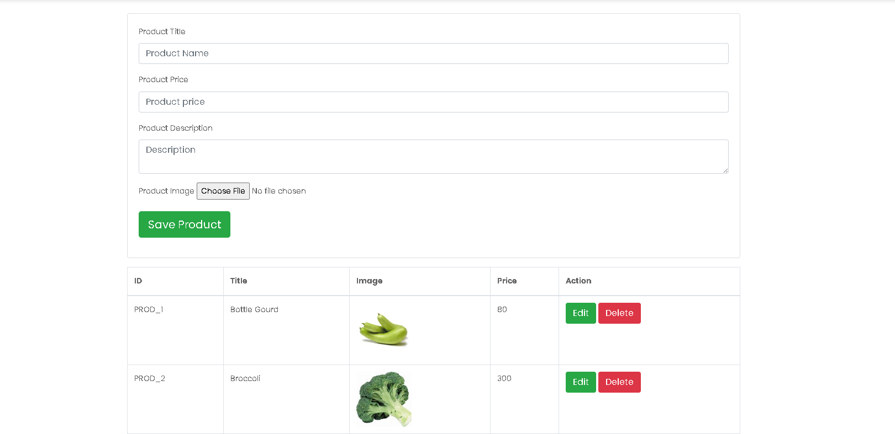

"# codealpha_tasks" 
```
🛒 Express E-Commerce Website
This is a simple and responsive e-commerce website built using Express.js, EJS, and Bootstrap. It includes multiple pages such as Home, Shop, Cart, and Admin. The goal is to provide a dynamic shopping interface with basic cart functionality and an admin view for managing products.
```

📸 Screenshots

🏠 Home Page


🏠 Home Page About Section



🏠 Home Page (why choose us) Section



🏠 Home Page contact Section


🛍️ Shop Page


🛒 Cart Page


🔐 Admin Page


🚀 Features
Responsive UI with Bootstrap
Dynamic templating using EJS
Add to cart functionality
Admin interface to manage products
Clean and structured Express routing
🛠️ Tech Stack
Backend: Node.js, Express.js
Frontend: HTML, CSS (Bootstrap), EJS
Templating: EJS
Styling: Bootstrap 5
File Handling: Multer (if used for image uploads)
⚙️ Installation
Clone the repository
git clone https://github.com/your-username/your-repo-name.git
cd your-repo-name
Install dependencies


npm install
Run the project


npm start
Open your browser and visit:


http://localhost:3000
```
📁 Project Structure

project/
│
├── public/            
│   └── images/
|   └── css/
|   └── js/
├── routes/
│   └── admin.js/   
|   └── cart.js/    
|   └── shop.js/
│   └── home.js/
|   └── product.js/
├── uploads/          
├── views/            
│   ├── admin/
|      └── admin.ejs/
│   └── layouts/
|      └── header.ejs/
|       └── footer.ejs/
│   ├── cart.ejs/
│   └── index.ejs/
│   ├── product_details.ejs/
│   └── shop.ejs/
├── server.js            
├── package.json
└── README.md
```
🙌 Acknowledgements
Bootstrap

Express.js

EJS

📄 License
This project is build for an internship purpose.

---
```
#Social_Media_app#

This is a simple and responsive Social Media App built using Express.js, Bootstrap and react. It includes multiple pages such as Homepage, timeline, profilepage. The goal is to provide a dynamic interface with basic  functionality for Users
---
```
## 📁 Project Structure
```
Frontend
ReactFrontend
public/
├── assest/
│ ├── pofile/img
│ ├── post/img
├── style.css
├── ad.png
src/
├── components/
│ ├── login/
│ ├── register/
│ ├── feed/
│ ├── closeFriend/
│ ├── online/
│ ├── post/
│ ├── topbar/
│ ├── rightbar/
│ ├── share/
│ └── sidebar/
├── pages/
│ ├── home/Home.jsx
│ └── profile/Profile.jsx
| ├── context
├── dummyData.jsx
├── App.jsx
└── main.jsx
---
Backend
mini_Social_app

```


